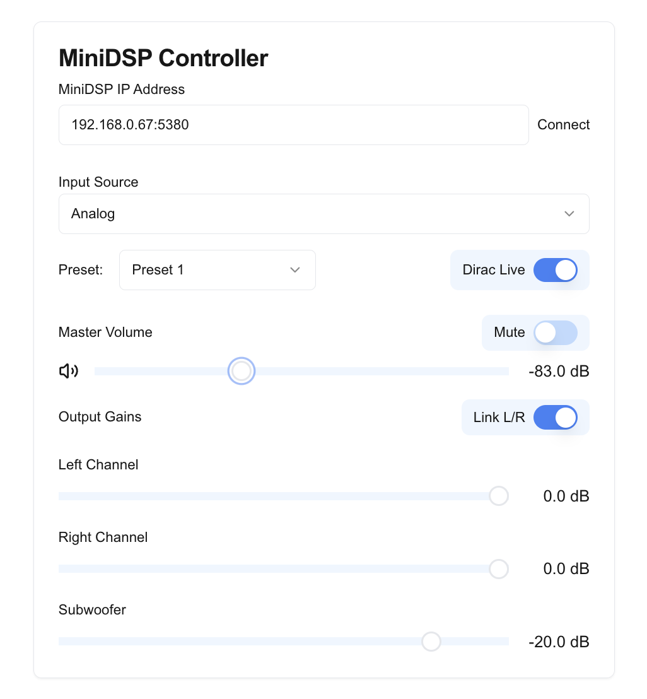

# MiniDSP Controller

This is a simple web interface to control a MiniDSP device, built using React and based on the API of [minidsp-rs](https://github.com/mrene/minidsp-rs).



## Features
- Control Master Volume, Mute, and Preset selection.
- Adjust output gains for left, right, and subwoofer channels.
- Enable or disable Dirac Live processing.

## Prerequisites
- minidsp-rs installed and running in server mode
- For Docker installation: Docker installed

## Installation and Usage

### Option 1: Run Locally

1. Install and run minidsp-rs:
   ```bash
   # Install minidsp-rs (follow instructions from their repository)
   minidsp server --http 0.0.0.0:5380
   ```

2. Install Node.js (v18 or later recommended)

3. Clone and set up the UI:
   ```bash
   git clone https://github.com/lucapinello/minidsp-ui.git
   cd minidsp-ui
   npm install
   npm run dev
   ```

4. Open your browser and navigate to:
   [http://localhost:3000](http://localhost:3000)

### Option 2: Use Docker (Recommended)

#### Simple Container
Run the UI container:
```bash
docker run -p 3000:3000 lucapinello/minidsp-ui
```

#### Using Docker Compose
For a complete setup including minidsp-rs:

1. Copy the example compose file:
   ```bash
   cp docker-compose.example.yml docker-compose.yml
   ```

2. Start the services:
   ```bash
   docker-compose up
   ```

The UI will be available at [http://localhost:3000](http://localhost:3000)

## Configuration

The UI needs to know where to find the minidsp-rs server. This can be configured in two ways:

1. Environment variable:
   ```bash
   MINIDSP_API_URL=http://localhost:5380
   ```

2. Through the UI's settings panel (IP address input)

## Development

For development instructions, building from source, and contributing guidelines, see [DEVELOPMENT.md](DEVELOPMENT.md).

## Acknowledgments
- This project is based on the API of [minidsp-rs](https://github.com/mrene/minidsp-rs).
- Built with [Next.js](https://nextjs.org/).

## License
[Affero](./LICENSE)

